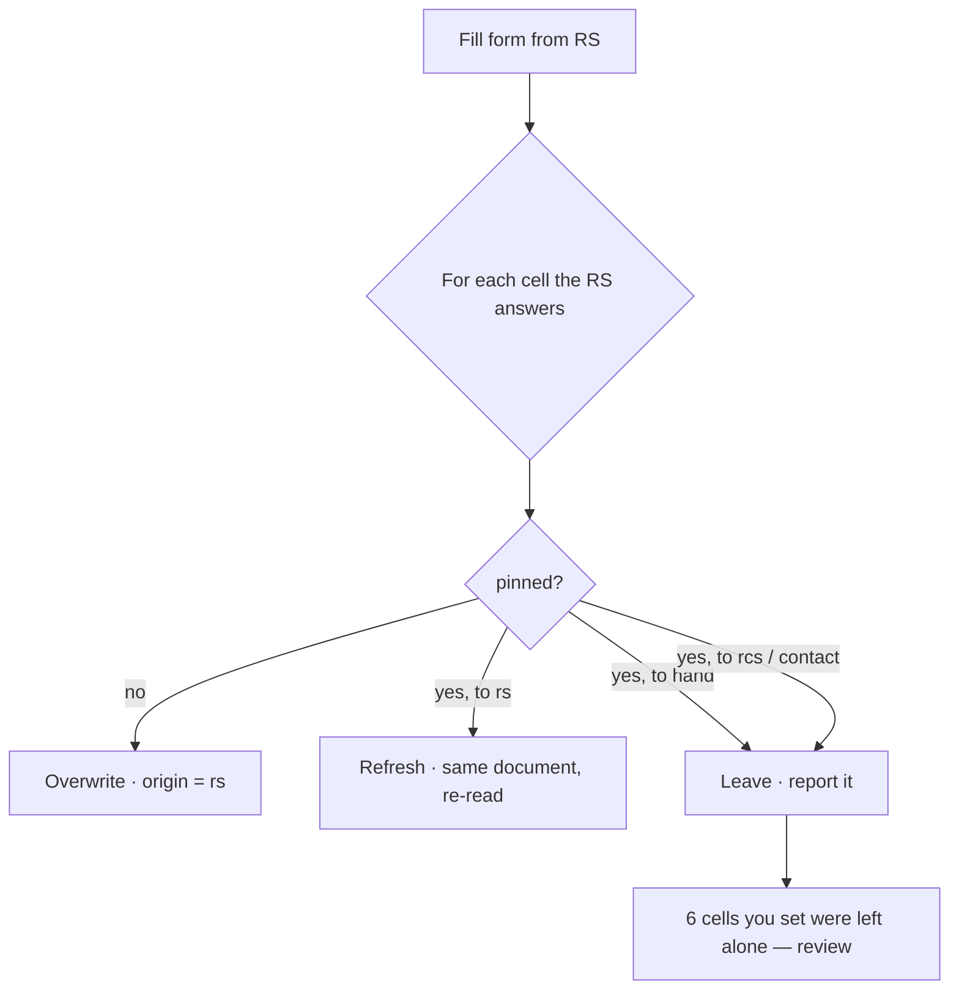
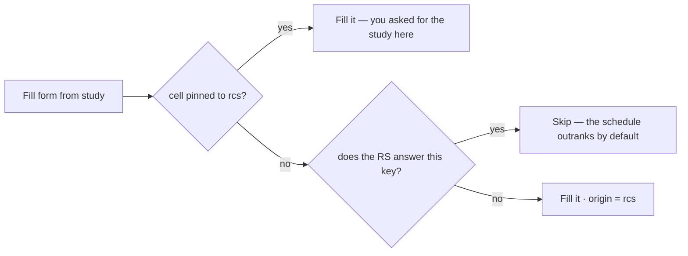
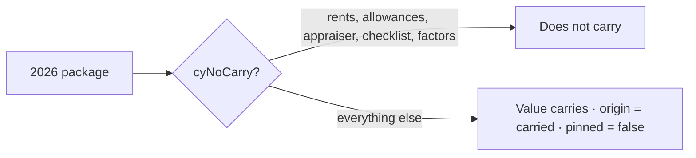

# Where every value comes from, and what may overwrite it

2026-07-31. A design for cell provenance. Nothing here is built. The inventory below
was read off `app.js`, not recalled — every writer of a cell value was found by
enumerating the 73 `store.editForm` call sites and grouping them by their enclosing
function.

---

## 1. The problem, in one measured sentence

The app cannot tell a **reading** ("the document says $1,146") from a **decision**
("I want $1,146"), so it treats every cell as a reading and refreshes it. Measured:

- Typing `MY OWN NUMBER` into Section 8 #, then pressing "Fill form from RS", returns
  `RS-S8`. Silently. No record that a person had entered anything.
- Two documents disagreeing on three fields, then "Fill form from study": **nothing
  changes at all.** `rsOffers` is an absolute permanent gate, not a first-fill tiebreak.
- A value that carries into next year's package arrives as plain `database` — blue, "on
  file" — with no memory of the document it came from.

---

## 2. Every origin

Eleven writers reach a cell. Nine put data in it; two are housekeeping and must not
claim authorship.

| Origin | Written by | Where it may write |
|---|---|---|
| `record` | `store.fillForm()` on open | every key — the on-file baseline |
| `carried` | `createCycle`, both data layers | everything not in `cyNoCarry` |
| `ra` | `applyRaLocked` | `property.name`, `rent_schedule.date_eff_ra` |
| `rs` | `rsFillFromParsed`, `[data-srck]` | `RS_CARRIES` — name, FHA/S8, entity, principals, signatory, unit mix, current rents, executed UA, effective date |
| `rcs` | `rcsFillFromParsed`, `[data-srck]` | `RCS_CARRIES` — appraiser, point of contact, proposed rents, study's UA / SAFMR / unit figures |
| `hud` | `applyHudSafmr` | `units.N.safmr_hud` |
| `fr` | `pullOcafFactor`, `pullUafFactors` | `ocaf.factor_*`, `uaf.f_*`, `uaf.factor_*` |
| `computed` | `ocafApplyRents`, `uafApplyUas` | `units.N.proposed`, `units.N.ua_custom` |
| `contact` | `pocSelectContact`, `dirFill` | `poc.*`, `appr.*`, `ca.*` from the saved directory |
| `default` | `applyChecklistDefaults` | `check.0…16` |
| `hand` | ~30 handlers in `wireBody` | anything with an input, checkbox, chip or tick |

**Not authorship, and must leave origin alone:** `syncReviewed`, `clearUncheckedWriteins`,
`refreshPrincipalOpts`, `handleZeroUnitCommit`, `revertKeys`, `srcRevertCell`,
`srcSetSource`/`srcEditKey` (they move a pointer within a cell the user is already
deciding). A revert restores the origin it restores the value from.

### The two flags that already exist

`form[k].fromParse` and `form[k].fromPick` are set today by the parse fills and the
directory picks. They are read only for note wording and save-grouping, they are
per-session, and `editForm`'s explicit shape drops them on the next edit. **This design
is those two flags generalised and persisted** — which is why it is smaller than it
looks.

---

## 3. Origin is not enough — a second bit is needed

The same origin arrives two ways:

- you pressed **"Fill form from RS"** — a bulk reading. The app chose the cells.
- you clicked **the "Executed RS" row on one cell** — a decision. You chose that cell.

Both leave `origin = rs`. Only the second may not be overwritten by a later study fill.
So each cell carries:

```
origin  : record | carried | ra | rs | rcs | hud | fr | computed | contact | default | hand
pinned  : true when a PERSON put it there — typed, or picked that row
```

`hand` always implies `pinned`. Everything else is pinned only by an explicit click.

---

## 4. What a fill does



Today, every one of those branches overwrites, silently.

The report is the important half. It is not a warning dialog — it is a list under the
source card naming each skipped cell, with "use the RS here" on each one. The default is
to protect; accepting is one click per cell.

---

## 5. `rsOffers` becomes a default, not a law

Today: the study may never fill a key the schedule answers, forever, whatever the user
wants. This is right as a *tiebreak for a cell nobody has decided* and wrong as a
permanent rule.



The precedence ladder stays `ra > rs > rcs > everything else` for undecided cells, and
`ra` stays absolute because that one is a lock, not a preference.

---

## 6. Typing stops snapping back

Today, typing `31` into a utility allowance whose executed figure is `31` sets the source
pointer back to `exec` and clears the custom key. The intent was FORM-RULES 3 — *a figure
equal to a source we hold IS that source* — and for the **badge** it is right.

For **provenance** it is wrong: it silently converts a decision into a subscription. The
two look identical today and diverge later, invisibly, when the document is re-read and
the cell follows it somewhere the person never agreed to.

Under this design they separate cleanly:

- typing sets `origin = hand`, `pinned = true` — always
- the badge may still say **`typed · matches RS`**, which is strictly more than it says now

The pointer machinery (`*_source`) keeps working exactly as it does; it stops being the
only record of intent.

---

## 7. Carry demotes



A 2026 origin must not claim that *this* year's rent schedule says so, and a decision
made about the 2026 package must not silently protect a cell in 2029 — otherwise one
typo becomes permanent. `carried` is honest, distinct from both typed and read, and
freely overwritable by this year's documents.

**This is the one judgement call in the design.** The alternative — carrying `pinned`
forward — buys "my correction survives the year" at the cost of a mistake that can never
be refreshed. Annual re-reading is the point of the cycle, so demotion wins.

---

## 8. What the badge says

The badge stops being computed by comparison and starts reporting the origin.

| Origin | Badge | Note |
|---|---|---|
| `rs` / `rcs` | `RS` / `RCS` | `· pinned` when you chose it |
| `ra` | `RA` | cell is locked, no badge needed |
| `hud` / `fr` | `HUD` / `FR` | with the fiscal year, as now |
| `computed` | `calc` | |
| `contact` | the contact's name | |
| `hand` | `typed` | `typed · matches RS` when it also agrees |
| `carried` | `2026` | the year it came from |
| `record` / `default` | none | |

This answers the complaint that started this: click the study, the badge says RCS, even
when both documents agree — because it reports what put the value there rather than
guessing from the value.

---

## 9. Cost

**Data layer.** Cells persist as `{value, saved_at}`. This adds two fields. Both layers,
`db.cosmos.js`, and the Supabase schema — `schema.sql` and a migration.

**core.js.** `editForm(form, key, value, origin)`. Omitting it means `hand`, which is the
safe default: a writer that forgets to declare itself is treated as a person, and a
person's entry is never silently overwritten.

**app.js.** Nine writers declare an origin — one line each. The fills gain the skip list
and the report. `srcTags` reads origin instead of comparing.

**Tests.** The interaction matrix in §4 and §5 is a table of cases; each row is a check
in `test_browser.js`. The carry rules belong in `test_db.js` beside the existing ones.

Roughly a day. It retires the two-family split described in `CELL-MODEL.md`: Family A's
`*_source` pointer becomes one special case of `origin`, and Family B stops being
second-class.

---

## 10. What this does not solve

- **A cell with two right answers.** If the schedule and the study disagree and neither
  is pinned, the schedule wins by default and the disagreement is invisible unless you
  open the dropdown. The UA and SAFMR cells already have conflict UI for exactly this;
  the rest do not. Worth a separate look.
- **Which document, not just which kind.** `origin = rs` does not say *which* rent
  schedule. `cycle.rs_doc` already stores the reading per package, so the link exists —
  it is just not on the cell.
